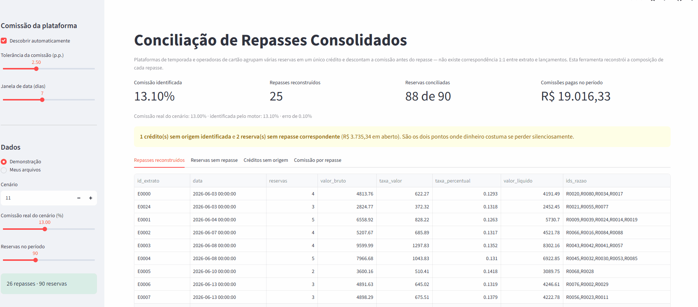

# Conciliação Bancária Automática

**Cruza extrato bancário e razão contábil, concilia o que casa e classifica o que sobra — em segundos.**

[](https://python.org)
[](tests/)
[](LICENSE)

▶ **[Demo — Repasses de plataforma](https://conciliacao-bancaria-automatica-repasses.streamlit.app)** · ▶ **[Demo — Conciliação geral](https://conciliacao-bancaria-automatica-rep.streamlit.app)** · 📊 [Relatório de exemplo](dados/exemplo/relatorio_conciliacao.xlsx)

<!-- Substitua pelo GIF da ferramenta rodando: assets/demo.gif -->


---

## O problema

Em uma PME, a conciliação bancária mensal é feita à mão: alguém abre o extrato de um lado, o razão do outro, e vai marcando linha por linha. São de 4 a 8 horas por cliente, todo mês, em um processo repetitivo e sujeito a erro humano — e o erro só aparece no fechamento, quando custa caro.

O trabalho difícil não é encontrar o que bate. É explicar o que **não** bate.

## O resultado

| Indicador | Processo manual | Com a ferramenta |
|---|---|---|
| Tempo de execução | 4 a 8 horas | **menos de 1 segundo** |
| Conciliação automática | — | **98,1%** do extrato |
| Divergências | listadas à mão | **classificadas por tipo e severidade** |
| Entregável | planilha improvisada | **relatório Excel em 4 abas** |

No cenário de demonstração (318 movimentos bancários × 325 lançamentos contábeis), o motor conciliou 312 linhas e isolou 22 divergências — recuperando **exatamente** as que haviam sido injetadas no dataset de teste.

## Como funciona

Cascata determinística de seis estágios, do mais restritivo ao mais permissivo. Cada estágio recebe apenas o que o anterior não conseguiu casar, e todo par conciliado sai imediatamente do pool — nenhum registro é usado duas vezes.

| # | Estágio | Critério |
|---|---|---|
| 1 | `documento_e_valor` | documento idêntico + valor idêntico |
| 2 | `valor_e_data` | valor idêntico + mesma data |
| 3 | `valor_data_aproximada` | valor idêntico + data dentro da janela |
| 4 | `divergencia_valor` | documento idêntico + valor dentro da tolerância |
| 5 | `similaridade_historico` | valor idêntico + histórico similar |
| 6 | `agrupamento` | soma de N lançamentos = 1 crédito consolidado |

O estágio 6 resolve o caso que mais trava conciliação manual: a operadora de cartão repassa um valor único que corresponde a vários títulos no razão.

## Módulo de repasses consolidados

Plataformas como Airbnb e Booking, e operadoras de cartão, não creditam uma venda por vez: agrupam várias em um único repasse e descontam a comissão antes de creditar. O resultado é que **nenhuma linha do extrato bate com nenhuma linha do razão** — e é por isso que a conferência manual desse caso é tão cara.

```
Razão:    Reserva A  R$ 1.200,00
          Reserva B  R$   800,00
          Reserva C  R$   500,00
                     ------------
                     R$ 2.500,00   (bruto)

Extrato:  Repasse    R$ 2.150,00   (líquido, após 14% de comissão)
```

O módulo `src/repasses.py` reconstrói a composição de cada crédito resolvendo a soma de subconjunto **líquida**. Ele:

- **descobre a comissão sozinho**, sem o cliente precisar informar (erro abaixo de 1 p.p. nos cenários de teste, tanto a 3% quanto a 14%);
- reconstrói quais reservas formaram cada repasse;
- aponta **reservas faturadas que nunca foram creditadas** — a perda silenciosa mais cara dessa operação;
- aponta **créditos sem origem identificada**;
- acompanha a comissão efetiva ao longo do tempo, revelando cobrança fora do padrão.

A busca usa janelas contíguas na ordem cronológica em vez de força bruta combinatória: plataformas fecham lote por período, não por seleção arbitrária. Isso elimina a classe de falso positivo em que dois conjuntos diferentes, com comissões diferentes, chegariam ao mesmo valor líquido.

```bash
streamlit run app_repasses.py    # demonstração deste módulo
```

### O que sobra é classificado

| Tipo | Significado | Severidade |
|---|---|---|
| `nao_contabilizado` | movimento no banco sem lançamento no razão | alta |
| `nao_compensado` | lançamento contábil sem compensação bancária | alta |
| `divergencia_valor` | mesmo documento, valores diferentes | alta |
| `divergencia_data` | competência e compensação em dias distintos | baixa |

## Sobre os dados

**Todos os dados deste repositório são sintéticos**, gerados pela biblioteca Faker. Nenhum dado real de cliente, empregador ou instituição financeira é utilizado, versionado ou distribuído aqui.

O gerador injeta propositalmente divergências de cada tipo, o que dá aos testes um gabarito conhecido: é possível verificar se o motor encontra exatamente o que foi escondido.

## Como rodar

```bash
git clone https://github.com/AlezinGG/conciliacao-bancaria-automatica.git
cd conciliacao-bancaria-automatica
pip install -r requirements.txt

python main.py --demo          # cenário sintético + relatório Excel
streamlit run app.py           # interface interativa
pytest -q                      # suíte de testes
```

Com seus próprios arquivos:

```bash
python main.py --extrato extrato.csv --razao razao.csv --saida relatorio.xlsx
```

### Formato de entrada

| Coluna | Obrigatória | Observação |
|---|---|---|
| `data` | sim | qualquer formato reconhecido pelo pandas |
| `valor` | sim | positivo para crédito, negativo para débito |
| `historico` | sim | texto livre |
| `documento` | não | melhora muito a precisão quando presente |

## Estrutura

```
├── app.py                    interface Streamlit (conciliação geral)
├── app_repasses.py           interface Streamlit (repasses de plataforma)
├── main.py                   execução via linha de comando
├── src/
│   ├── conciliacao.py        motor de conciliação (cascata de 6 estágios)
│   ├── repasses.py           repasses consolidados com dedução de comissão
│   ├── gerador_dados.py      dados sintéticos com gabarito
│   └── relatorio.py          exportação Excel formatada
├── tests/                    19 testes: gabarito, invariantes, casos de borda
└── dados/exemplo/            saídas geradas
```

## Decisões de projeto

**Determinístico, não probabilístico.** Um contador precisa auditar por que duas linhas foram casadas. Toda decisão do motor é reproduzível e vem etiquetada com o método e o score que a produziram.

**Conservador por padrão.** Na dúvida, o motor deixa pendente em vez de conciliar errado. Falso negativo custa cinco minutos de conferência; falso positivo esconde um erro no fechamento.

**Testado por invariante.** Além do gabarito, a suíte verifica que nenhum registro é conciliado duas vezes, que a soma dos lotes confere e que linhas de sinais opostos jamais se cruzam.

---

## Autor

**Alexandre Gonçalves Rodrigues** — Analista Financeiro (FP&A)
Automatização de rotinas financeiras e contábeis com Python, SQL e Power BI.

[LinkedIn](https://www.linkedin.com/in/alegoncalves158/) · [Outros projetos](https://github.com/AlezinGG)

Disponível para projetos de automação financeira.

## Licença

MIT — veja [LICENSE](LICENSE).
